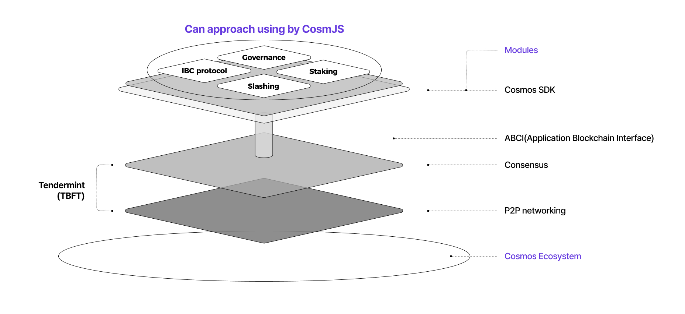

# Structure

케플러를 통해 모든 코스모스 생태계에 있는 각종 체인 및 자산 관리가 가능합니다. 코스모스 SDK 모듈 중 IBC protocol은 우리 생태계에 있는 모든 네트워크가 상호 소통하도록 만드는 프로토콜입니다. 케플러는 코스모스 생태계의 IBC protocol을 지원하는 유일한 수단입니다. 아래 토글을 통해 코스모스 생태계에 대한 전반적인 구조를 이해할 수 있습니다.&#x20;

마지막으로, 케플러는 CosmJS와 같은 라이브러리에 쉽게 연결할 수 있어 웹페이지를 블록체인에 연결하는 프로세스를 단순화할 수 있습니다. CosmJS로 케플러를 다루고 싶으면 [이곳](tools-and-libraries/cosmjs.md)을 클릭해주세요.

<figure><figcaption>
Structure of the Cosmos
</figcaption></figure>

The structure of Cosmos ecosystem

코스모스 생태계는 아래와 같은 세 가지 레이어로 구성되어 있습니다.

*   **P2P 네트워킹 레이어**

    네트워크 참여자 사이에서의 소통은 모든 블록체인 시스템에서 필수적인 요소입니다. 분산 원장 기술 기반의 시스템에 필요한 소통 방식은 매우 다양합니다. 무엇보다도 합의 레이어에 닿아야 하는 책임이 있는 노드는 결정을 내리기 위해 또 다른 노드와 소통해야 합니다. 유저들은 이러한 일련의 과정을 통해 거래를 보낼 수 있는 상태가 됩니다. 마지막으로 제 3자로 참여하는 어플리케이션 (예를 들어 스마트 컨트렉트, 지갑, 혹은 dApp)은 블록체인과 거래할 채널(경로)을 찾아야 하며, 이 P2P 네트워크 층이 이를 지원합니다. 결론적으로 네트워크 레이어는 모든 종류의 노드 간 소통 방식을 촉진시키고, 원활하게 할 의무가 있는 레이어입니다.

<!---->

*   **합의 레이어**

    블록체인은 검증과 거래의 주문에 대한 확실한 합의 과정에서 이뤄지는 분산 원장 기술을 채택하고 있습니다. 이러한 과정 동안에 네트워크 참여자들(채굴자, 검증인 etc.)는 제안하고, 검증하며 거래의 블록을 처리합니다. 이러한 노드는 자신 이외의 노드를 믿을 필요가 없습니다. 게다가 다른 노드에 대해 과업을 수행하는 알고리즘은 각각의 합의 모델에 따라 달라집니다. 이렇듯, 합의 레이어는 노드의 모든 합의 과정과 관련된 과업을 조절하는 모듈로써 역할을 수행합니다.

<!---->

*   **어플리케이션 레이어**

    블록체인은 분산원장 시스템을 정의할 때 사용하는 일반적인 용어입니다. 이러한 원리로, 각각의 블록체인은 탈중앙화된 어플리케이션을 만들기 위한 기반시설이 됩니다. 예를 들어, 비트코인은 탈중앙화 P2P 결제시스템입니다. 이더리움은 스마트 컨트렉트를 개발하기 위한 블록체인 입니다. 그러므로 각각의 네트워크 공간에서 정의된 프로젝트는 그것만의 비즈니스 논리를 가질 필요가 있습니다. 이것이 다른 프로젝트들을 사용하는 사례를 구분하는 가장 명확한 특징입니다. 어플리케이션 레이어는 각 프로젝트의 구성 로직들이 정의되고, 구현될 수 있는 ‘모듈’이라 할 수 있습니다.

P2P 네트워킹 레이어와 합의 레이어 층을 Tendermint core 라 부릅니다. 이들은 ABCI(Application BlockChain Interface)라는 프로토콜에 의해 애플리케이션 층에 연결됩니다. 물론 Tendermint Core은 블록체인에서의 개발시간을 몇 년에서 몇 주 단위로 단축하지만, 처음부터 ABCI-APP을 구축하는 것은 어렵습니다. 이것이 바로 코스모스 SDK가 존재하는 이유입니다.&#x20;

코스모스 SDK는 텐더민트 코어 위에 안전한 블록체인 에플리케이션 구축 과정을 간소화시키는 일반화된 프레임워크입니다. Cosmos SDK로 개발된 어플리케이션 구조는 프로토콜 연결을 위한 인터페이스 및 서버 상호 작용이 중요합니다. CosmJS(Typescript/Javascript) 라이브러리를 활용하면 개발자가 프론트엔드 사용자 인터페이스와 백엔드 서버 등의 분산 어플리케이션을 구현을 쉽도록 도와주며, 코스모스 생태계와 통합하는 데에 편리하게 사용될 수 있습니다.

